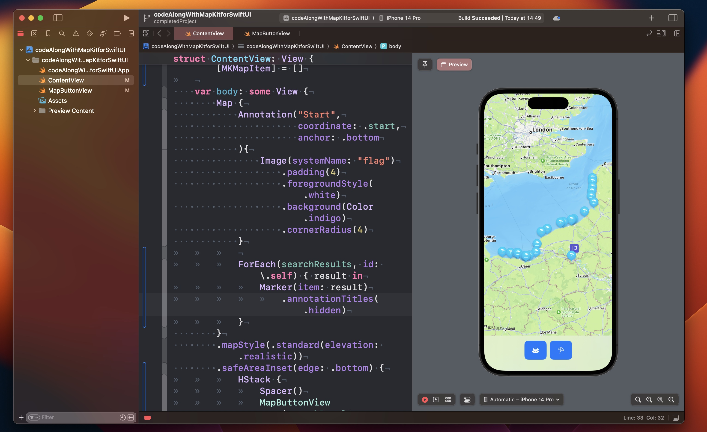

# Code Along Project With MapKit for SwiftUI

This is a code along project, the main branch has the starter project in Xcode, which is mostly empty. It should just only display a map of your region.  
You can check the completedProject branch of the project for the finished version.

# Let's start

Xcode by default will show the map of the region you are in when building and showing the preview in the simulator. This is the standard behaviour when no parameters are passed in the map initializer.  

We are in the Normandie, in Rouen, and we will start a weekend bike trip going surfing and visiting the coast.  
for convenience we add our start location as a static variable in this extension. Just a clean way to store our first variable.

We use now the map builder closure to put this location on the map.
```swift
extension CLLocationCoordinate2D {
    static var start = CLLocationCoordinate2D(latitude: 49.44625973148958, longitude: 1.0889092507665954)
}

struct ContentView: View {
    var body: some View {
        Map {
            Marker("Start", coordinate: .start)
        }
    }
}

```

The marker is ok but perhaps a bit boring. We can do better with annotations! replace the marker with this:

```swift
Annotation("Start",
  coordinate: .start,
  anchor: .bottom
){
Image(systemName: "flag")
 .padding(4)
 .foregroundStyle(.white)
 .background(Color.indigo)
 .cornerRadius(4)
}
```

We can use the  .annotationTitles(.hidden) modifier to hide the title of the annotation if we wish.  Also, we can choose different map styles.  
I like `.mapStyle(.standard(elevation: .realistic))`

## Add buttons

For the buttons I would like to use a translucent bar at the bottom of the full screen map. I will use a `safeareainset` with my buttons inside. The buttons will allow me to display a search for cafes and beaches.  

### The buttons
Let's create a new swiftUI file; we call it MapButtonsView and add this code in its body.

```swift
        HStack {
            Button {
                search(for: "cafes")
            } label: {
                Label ("Cafes", systemImage: "cup.and.saucer.fill")
                .frame(width: 44, height: 44)
            }
            .buttonStyle(.borderedProminent)
            
            Button {
                search(for: "beach")
            } label: {
                Label ("Beaches", systemImage: "beach.umbrella")
                .frame(width: 44, height: 44)
            }
            .buttonStyle(.borderedProminent)
        }
        .labelStyle (.iconOnly)

```  
NB: The label icons have different heights and it doesn't look so good when displayed next to each other. Adding a frame to the HStack would not solve the problem. I need to insert the frame modifier **before** to apply the `borderedProminent` button style or it will not change!  

Pressing a button will trigger the search. The results will be stored in a searchResults variable. It will be a binding because we will pass the results to our parent view...

Here I will store my results:
```swift
    @Binding var searchResults: [MKMapItem]
``` 
Here is the search function to be added in the struct. 
```
    func search(for query: String) {
        let request = MKLocalSearch.Request ()
        request.naturalLanguageQuery = query
        request.resultTypes = .pointOfInterest
        request.region =  MKCoordinateRegion (
            center: .start,
            span: MKCoordinateSpan (latitudeDelta: 0.0125, longitudeDelta: 0.0125))
        
        Task {
            let search = MKLocalSearch (request: request)
            let response = try? await search.start ()
            searchResults = response?.mapItems ?? []
    }
```

Back in my contentView Ill add a @State property to store the search results.

`@State private var searchResults: [MKMapItem] = []`

I will add the buttons above the map at the bottom of the screen. I will use the `safeAreaInset` view for this.
In my `Map()` content builder I add the buttons

```swift
.safeAreaInset(edge: .bottom) {
	HStack {
		Spacer()
		MapButtonView(searchResults: $searchResults)
			.padding(.top)
		Spacer()
	}
	.background(.thinMaterial)
```

Now that I get my search result when the user taps the button, I need to display it in the map. I add a `ForEach` in the content builder which will create the markers for each result:

```swift
ForEach(searchResults, id: \.self) { result in
    Marker(item: result)
}
.annotationTitles(.hidden)
```

Try to press a button and see what happens. In Xcode 15 beta the previews are interactive.
Notice how the map view get resized automatically to include our search results.  I think this is quite nice!
The markers icons are out of the box the default ones provided by Apple Maps:  



### Relevant Links
[The GitHub repo with the project](https://github.com/multitudes/codeAlongWithMapKitforSwiftUI)

[WWDC23 - Meet MapKit for SwiftUI](https://developer.apple.com/videos/play/wwdc2023/10043/)

[WWDC22 - What's new in MapKit](https://developer.apple.com/videos/play/wwdc2022/10035/)

[MapKit docs](https://developer.apple.com/documentation/mapkit) [MapKit for SwiftUI docs](https://developer.apple.com/documentation/mapkit/mapkit_for_swiftui)
